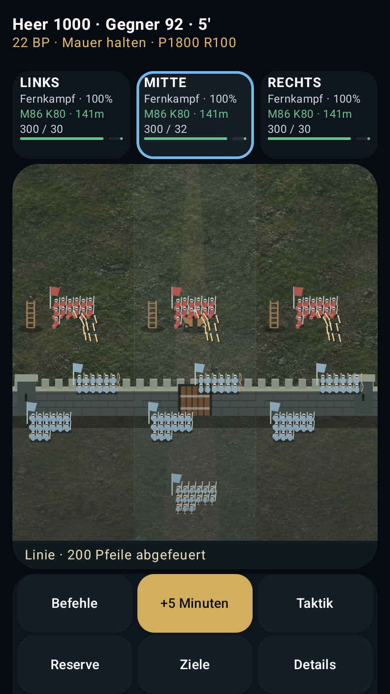

# Schlachten: Formationen, Salven und Mauerverteidigung

Basis: `codex/v1.0-realm-war-overhaul` bei `07b525a` (Combat Engine 3.0,
App 1.0.0/46, Save-Schema 5). Umsetzung auf
`codex/battle-formations-and-wall-defense`, PR-Ziel ist der v1.0-Branch.
`main` wurde weder ausgecheckt noch als Grundlage verwendet.

`AGENTS.md` und `docs/NEXT-LEVEL-SANDBOX-MASTER-AUFTRAG.md` wurden vollständig
vom UX-Branch bei `3b1fc79` gelesen: Auf der v1.0-Basis fehlen diese beiden
Dateien noch. PR #10 bleibt separat; seine Empfehlungen, Dashboard- und
Kommandozentrale-Dateien werden hier nicht erneut implementiert. Dessen
CI-Lauf `37890030066` hat Build und alle sieben vorhandenen Android-Tests
bestanden und liefert den Vorher-Vergleich der unveränderten Schlachtansicht.

## Drei konkrete Lücken

1. Die bisherigen Kleingruppen haben die tatsächliche Formation nicht gezeigt.
   Die UI schnitt zudem die vom Engine-Helfer gelieferten Gruppen pro Front ab.
2. Salven dauerten nur 100–300 ms. Ein Pfeileinschlag durfte durch beliebigen
   Gesamtschaden ausgelöst werden, etwa durch Nahkampf statt durch Pfeile.
3. Eigene und gegnerische Mauerschützen wurden nicht zuverlässig der
   verteidigenden Seite zugeordnet. Die breite Mauer bestand aus drei flachen
   Balken; Torzustand, Aufstellung und Schaden waren schwer zu lesen.

## Umgesetzter Schnitt

- `BattleSceneProjection.kt` bildet echte Kontingente, Gegner-Roster, aktive
  Formationen, Moralbruch, Kommandanten, lokale Segmente, Entfernungen und
  Reserven auf reine Zeichendaten ab. Keine zweite Simulation und keine
  Soldaten- oder Ressourcenänderung. Kontingente werden nach Typ, Front,
  Formation und Fluchtstatus zusammengefasst; ihre Truppenzahlen bleiben erhalten.
- Linie, dichte und offene Ordnung erhalten verschiedene Reihen/Abstände;
  Schildwall, Speere, Bögen, Ritter, Artillerie und Monster haben eigene
  Silhouetten. Kulturfarben, Banner und Kommandantenmarkierungen bleiben
  unabhängig vom einzelnen Soldatenmodell. Figuren sind aggregierte Marker,
  keine Behauptung einer Simulation jedes einzelnen Soldaten.
- `TacticalBattleField.kt` animiert ausschließlich neue Engine-Austausche.
  Darstellungstempo: 1,8 Sekunden bei 1×, skaliert mit der vorhandenen
  Einstellung 0,5×–3×. Bewegung, gestaffelter Pfeilflug und Trefferrückmeldung
  haben endliche Zeitfenster. Laden, Taktikänderungen ohne Austausch und bloße
  Neuzeichnungen wiederholen keine Salven. Deaktivierte Animationen zeigen
  unmittelbar den aktuellen Zustand.
- Pfeile benötigen protokollierten Verbrauch. Pfeiltreffer benötigen
  `enemyDamage.ranged` bzw. `ownDamage.ranged`; Artillerie, Geräte-, Mauer-
  und Nahkampfschäden bleiben getrennt. Nahkampfrückmeldung benötigt
  Kontakt im Austauschbericht **und** null Distanz. Veraltete Berichte werden
  nicht als aktueller Austausch interpretiert.
- `BattleSceneDrawing.kt` zeichnet Steinlagen, Zinnen, Seitentürme, das
  tatsächliche Tor, lokale Breschen, Trümmer, Geräte und zustandsabhängiges
  Feuer. Schützen stehen nur auf einer erhaltenen, tatsächlich verteidigten
  Mauer; Rückfall oder lokale Bresche entfernen diese Position. Der schmale
  Wehrgang verwendet höchstens zwei repräsentative Reihen; die tatsächliche
  Truppenzahl bleibt auch bei großen Schützenkontingenten vollständig erhalten.
- Der Reservemarsch erscheint als Route. Soldaten bleiben bis zur echten
  Engine-Ankunft im Reservekontingent. Sichtbare Reihen erzeugen keine
  zusätzlichen Truppen. Die Auswahl einer Front verwendet weiterhin die
  bestehenden Befehle, deren Kosten und Reaktionszeiten.
- Eine lesbare, umbrechende Bildunterschrift zeigt aktive Formation und
  Feuerstatus/Verbrauch. Sie erhält eigenen Layoutplatz; sie überdeckt weder
  Reserven noch die vorhandenen sechs Aktionen. Screenreader erhalten echte
  Zahlen, Distanz, Formation, Kontakt und Segmentzustand.

## Bestehende Zuständigkeiten und Kompatibilität

`BattleEngine` orchestriert weiterhin Befehle, Reserven und Replay;
`BattleResolutionEngine` berechnet Verluste, Munition und Zielwahl;
`SiegeEngine` Bewegung, Kontakt, Tor und lokale Breschen;
`FrontierEngine` die vorhandenen Mauerwaffen;
`BattleStateEngine` Initialisierung/Validierung;
`BattleReportEngine` und `WarEngine` Ursachen, Verwundete und Kampagnenfolgen.
`SaveCodec` und `SaveRepository` bleiben unverändert.

Keine neue Speicherstruktur, Schemaänderung oder Migration. Schema 4→5 und
geschützte Original-Backups bleiben erhalten. Die neue Projektion ist nicht
serialisiert und wird aus dem geladenen Zustand abgeleitet. Auch 100 Attribute,
30 Fertigkeitspunkte, drei Bauplätze, Missionstruppen, Kommandanten, Wirtschaft,
Diplomatie und Beziehungssystem werden nicht verändert.

## Grafikbestand und Art-Vorgaben

Alle Pfade relativ zu `app/src/main/assets/`:

| Bereich | Bestehende Quelle | Format / Verwendung |
| --- | --- | --- |
| Menü | `menu_cover.webp` | 1024×1536, Festungsillustration |
| Stadt | `city_landscape.webp` | 1672×941; eigentliche aktuelle Stadtgeometrie in `CityScene.kt` |
| Welt | `world_map.webp` | 1672×941; aktuelle Weltobjekte/Geografie in `CampaignMapScreen.kt` |
| Kulturen | `category_human.webp`, `category_wood_elf.webp`, `category_gold_elf.webp`, `category_wall.webp` | je 1672×941 |
| Gegner | `frontier/horde_{orc,uruk,taotei}.webp` | je 720×484 |
| Verbündete | `frontier/ally_{holds,gold,wall}.webp` | je 720×1072 |
| Schlacht | `battle-backdrops/ground.webp` plus Canvas-Geometrie | neu; Boden ohne vorgezeichnete Einheiten/Strukturen |
| Audio | `audio/cue_arrows.wav`, `cue_swords.wav`, `cue_artillery.wav`, `cue_gates.wav` | vorhandene lokale Effekte bleiben erhalten |

Palette: dunkles Moos/Erde, verwitterter Stein, entsättigter Stahl und warme
Goldakzente. Eigene Kulturen: Stahlblau, Waldgrün, Gold, Mauerlegionsblau;
Gegner: gedämpftes Rot. Waffen und Formation sind zusätzlich an ihrer Form
erkennbar. Keine Fotos oder fremden Spielassets ergänzt.

Produktionsquelle Boden: OpenAI-generiertes PNG, 1536×1024, erstellt
2026-10-09. Vorgabe: gleichmäßiges, kontrastarmes Moos/Erde/Kies in hoher
schräger Aufsicht; weiches bedecktes Licht; kein Horizont, keine Gebäude,
Truppen, Straßen, Vegetationsobjekte oder Schrift. Runtime: 1024×683 WebP,
Qualität 80, 215.876 Bytes, opak. Produktionsquelle:
[`art/source/battle-ground-1536x1024.png`](../art/source/battle-ground-1536x1024.png).
Die Quelle liegt außerhalb der Android-Assets und vergrößert die APK nicht.
Vorhandene optionale geländespezifische Backdrops
haben Vorrang. Ohne Bilddatei bleibt der vollständige prozedurale Boden aktiv.

## Leistungsbudget

- Höchstens 24 Figurenmarker pro Bataillon; gemeinsames Zielbudget 720.
  Die Zahl hängt von Kontingentarten ab, nicht von Millionen einzelner Soldaten.
- Maximal zwölf gezeichnete Pfeile je Seite/Front, repräsentativ für die
  protokollierte Salve. Die Bildunterschrift zeigt den echten Verbrauch.
- 110 deterministische Bodenmarkierungen; bestehende validierte Gerätezahl
  maximal 24; kein unbegrenztes Partikelsystem.
- Projektion, Gruppierung und Übergangszuordnung werden mit `remember`
  zwischengespeichert. Die Animationsuhr wird im Canvas gelesen; keine
  Bitmap-Decodierung oder Truppengruppierung pro Frame. Bildladung über Coil.
- Volles RGBA-Budget der Bodentextur ca. 2,67 MiB, zusätzlich zu bestehenden
  UI-Ressourcen. Kein Netzbedarf zur Laufzeit. Keine pauschale FPS-Garantie.

## Prüfplan und Nachweise

Gezielte Unit-Tests prüfen vollständige Truppenzählung, verschiedene
Formationen, verteidigende Seite, lokale Breschen/Rückfall, Markerbudget,
echte Pfeilsalven, Feuerhalten/leere Magazine, Trefferursachen, alte Berichte,
Animationstakt und unverändertes Speichern/Laden. Die bestehenden
Akzeptanztests für 200 Orks gegen 1.000 Verteidiger und für 1.500 starke
Belagerer werden weiter ausgeführt.

Die bestehenden Balancefälle wurden mit Seeds 1, 971 und 2026 erneut geprüft:
Die kleine Horde verursacht bei intakter Festung keine Verteidigerverluste und
erreicht keinen Nahkontakt. Die erfahrenen, gepanzerten 1.500 Angreifer mit
Geräten erreichen Kontakt und zerstören das Tor; nach 90 Simulationsminuten
verbleiben je nach Seed 803–810 Verteidiger. Das ist erhaltenes Verhalten von
Combat Engine 3.0, kein neu eingeführter Sonderbonus für die Darstellung.

Die sieben vorhandenen Android-Tests bleiben bestehen und prüfen zusätzlich
die neue Bildunterschrift. Ein gezielter achter Test zeigt das echte
1.000-gegen-200-Szenario vor/während/nach einer Salve und vergleicht zwei
ruhende Bilder, um fortlaufende Kampfanimationen auszuschließen.

Abgeschlossene lokale Prüfung des Quellstands `0673707`:

```sh
gradle :app:testDebugUnitTest :app:lintDebug :app:assembleDebug :app:assembleDebugAndroidTest --console=plain --max-workers=2
```

- 435 Unit-Tests: 426 vorhandene und 9 neue; 0 fehlgeschlagen, 0 Fehler,
  0 ausgelassen. Dazu gehören unverändert die Save-Migrationen, Replay-,
  Reserve-, Verwundeten-, Truppen- und Festungs-Akzeptanztests.
- Lint: 0 Fehler, 17 Warnungen und 20 Hinweise, wie auf der v1.0-Basis.
- Debug- und Test-APK gebaut. Alle vier Aufgaben waren nach der abschließenden
  Wehrgang-Korrektur in 3m 47s erfolgreich.
- Android 35: alle 8 Instrumentierungstests bestanden, 0 Fehler/ausgelassen,
  Laufzeit 49,802 s. Geprüft auf Pixel-4-Emulator (x86_64, Google APIs, KVM).
  Die Animation wird ausdrücklich eingeschaltet: Das Salvenbild muss sich vom
  Endzustand unterscheiden; danach müssen zwei Bilder pixelgleich ruhen.
- [GitHub Actions 37931782752](https://github.com/GoldenUnicorn24/Troopmanager/actions/runs/37931782752):
  Build/Unit/Lint/Signatur und Android-UI beide erfolgreich für `0673707`.
- `apksigner verify --verbose --print-certs`: v2-Signatur verifiziert.
  Paket `com.goldenunicorn.troopmanager`, Version 1.0.0/46, minSdk 26,
  targetSdk 35. Lokale APK 32.881.776 Bytes, SHA-256
  `5e20da32886038fda85fd85099ed5280e58c1cc8336f3240de7a35f4ba49f9d4`.
  Keine Internet-Berechtigung im APK-Manifest.
  Die APK verwendet den lokalen Debugschlüssel. Ein Update einer bereits
  installierten, anders signierten Version benötigt deren bisherigen Schlüssel;
  Spielstände dürfen nicht durch Löschen der App-Daten umgangen werden.
  Die separat in CI gebaute Debug-APK ist als
  [Actions-Artefakt](https://github.com/GoldenUnicorn24/Troopmanager/actions/runs/37931782752/artifacts/11617026608)
  verfügbar; wegen des eigenen CI-Debugschlüssels ist sie nicht bytegleich.

Nachweise: [Manifest](evidence/battle-visuals/verification.json),
[Unit-Tests](evidence/battle-visuals/unit-test-results.json),
[Balancefälle](evidence/battle-visuals/balance-acceptance.txt),
[Build](evidence/battle-visuals/final-verification.log),
[Android-Tests](evidence/battle-visuals/android-ui-results.xml),
[CI-Ergebnis](evidence/battle-visuals/ci-final-run.json),
[Lint](evidence/battle-visuals/lint-results-debug.xml),
[Signatur](evidence/battle-visuals/apk-signature.txt),
[Paketdaten](evidence/battle-visuals/apk-badging.txt),
[Quell-/Asset-Fingerprints](evidence/battle-visuals/source-fingerprints.json).

Der lokale Softwareemulator ohne KVM hatte beim Kaltstart ANRs in Telefon-,
Bluetooth- und System-UI-Diensten; der erste Instrumentierungsstart wurde
dadurch beendet. Ein weiterer Lauf wurde nach drei bestandenen Tests zugunsten
des beschleunigten CI-Geräts gestoppt. Er wird nicht als vollständiger Testlauf
gezählt. Die oben verlinkte vollständige Android-Abnahme stammt aus CI.
Reale Geräte-FPS, Langzeit-Speicherverhalten und API-26-Geräte bleiben separat
zu messen; die Zeichnungsbudgets sind keine Hardware-Benchmark-Ergebnisse.

## Sichtprüfung und Screenshots

Unveränderte PNG-Aufnahmen aus den Android-Tests. Die Größen bezeichnen
Compose-dp; die CI-Aufnahmen enthalten 2,75 Bildpixel je dp. Nachher-Artefakt:
`11616199282` aus dem oben genannten Lauf, exakt für den geprüften Quellstand.
Die sieben Aufnahmen wurden visuell geprüft: erreichbare Aktionen, lesbare
Legende, getrennte Waffenrollen, korrekte Mauerreihen und sichtbare Salve.

| Ansicht | Vorher | Nachher |
| --- | --- | --- |
| 320×568 | [PNG](evidence/battle-visuals/before/portrait-320x568.png) | [PNG](evidence/battle-visuals/after/portrait-320x568.png) |
| 320×568, Schrift 160 % | [PNG](evidence/battle-visuals/before/portrait-320x568-font160.png) | [PNG](evidence/battle-visuals/after/portrait-320x568-font160.png) |
| 640×280, Schrift 130 % | [PNG](evidence/battle-visuals/before/landscape-640x280-font130.png) | [PNG](evidence/battle-visuals/after/landscape-640x280-font130.png) |

Echte Festungssequenz mit 1.000 Verteidigern gegen 200 Orks:
[Aufstellung](evidence/battle-visuals/after/fortress-formation-1000-vs-200.png),
[Pfeile im Flug](evidence/battle-visuals/after/fortress-volley-in-flight.png),
[abgeschlossener Austausch](evidence/battle-visuals/after/fortress-volley-completed.png).
Zusätzlich: [Ereignisreaktionen im Querformat](evidence/battle-visuals/after/landscape-pending-event.png).



## Nächste vollständige Abschnitte

1. Figuren-Grafik: konsistente, animierbare Kultur-/Einheitengrafiken für die
   vorhandenen Rollen. Produktionsziel pro Rolle: transparente 256×256-Pixel-
   Frames in hoher schräger Aufsicht, acht Blickrichtungen, Zustände Warten,
   Marsch, Angriff, Treffer und Rückzug; Export in gepackte WebP-Atlanten mit
   Pivot-/Frame-Metadaten. Kontakt und Treffer werden weiterhin von den
   vorhandenen Austauschberichten ausgelöst. Diese Atlanten sind noch nicht erstellt.
2. Stadtansicht: sichtbare Ausbau-/Schadenszustände und passende Gebäudeaktionen
   in der bestehenden Stadtgeometrie; vorher/nachher mit zwei Ausbaustufen.
3. Weltkarte: tatsächliche Armeemärsche, Grenzen, Aufklärung und Handelsrouten.
4. Sandbox-KI/Wirtschaft und danach Mitregentin/Hof: echte Entscheidungen aus
   bestehenden Ressourcen, Erinnerungen und Präsenz; keine Pflichtkampagne.

Dieser PR liefert den ersten Schlachtenschnitt, keine abgeschlossene
Gesamtüberarbeitung aller Grafiken oder Sandbox-Systeme. Individuelle
Skelettanimationen, detaillierte Fraktions-Spriteatlanten, Gelände-Zoom und
eine vollständige Überarbeitung gegnerischer Artillerie-/Mauerwaffen-Flugbahnen
bleiben weitere Arbeit. Die bestehenden Berichte liefern nicht für jeden
Schuss einen einzelnen Schützen/Empfänger; die Darstellung behauptet das nicht.
